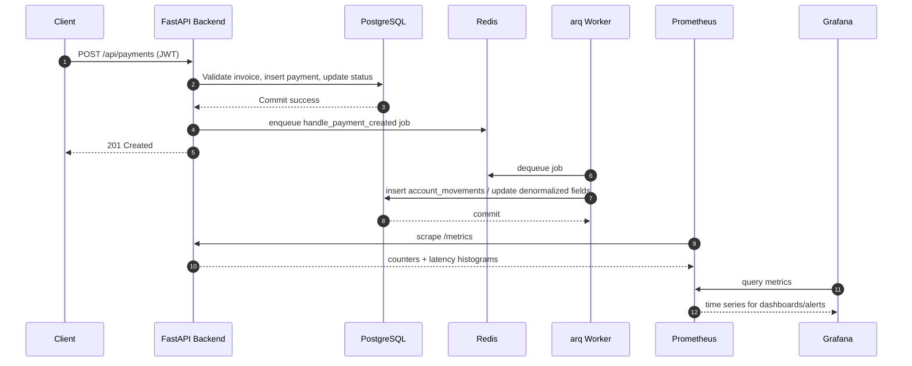
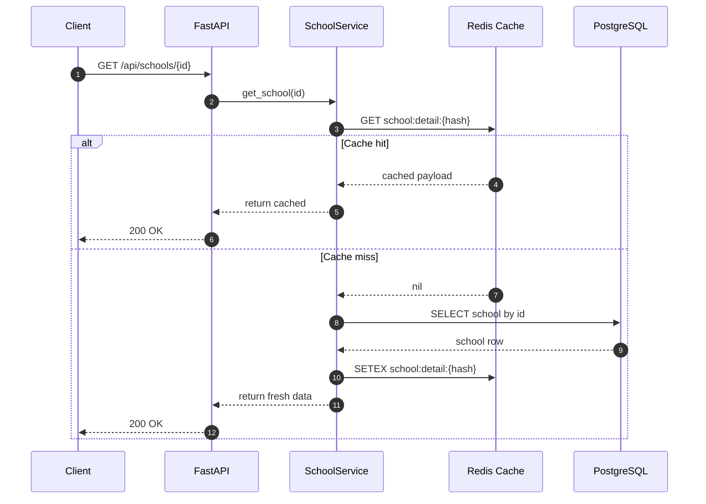

# FP2P - Full Project Playbook (Mattilda)

## 1) What This Project Is

Mattilda is a FastAPI backend + React frontend system for:

- School management
- Student management
- Invoice and payment lifecycle
- Authentication (JWT access + refresh)
- Event-driven accounting (Redis queue + arq worker)
- Redis read caching
- Prometheus/Grafana observability

Main backend entry:

- `app/main.py`

Frontend:

- `webapp/` (Vite + React, served by Nginx in Docker)

---

## 2) Architecture Summary

Request flow:

1. Route layer (`app/api/routes/*`)
2. Service layer (`app/services/*`)
3. Repository layer (`app/repositories/*`)
4. DB models (`app/db/models/*`)

Cross-cutting:

- Auth dependency: `get_current_active_user`
- Cache decorators + invalidation: `app/core/cache.py`
- Metrics middleware + `/metrics`: `app/core/metrics.py`, `app/main.py`
- Async events: `app/services/event_service.py`
- Background processing: `app/workers/account_worker.py`

---

## 3) Infrastructure (docker-compose)

Defined in `docker-compose.yml`:

1. `db` (PostgreSQL 15) - `localhost:5432`
2. `redis` (Redis 7) - `localhost:6379`
3. `backend` (FastAPI/Uvicorn) - `localhost:8000`
4. `worker` (arq consumer) - internal
5. `frontend` (React/Nginx) - `localhost:3000`
6. `prometheus` - `localhost:9090`
7. `grafana` - `localhost:3001`

Redis config includes:

- `appendonly yes`
- `maxmemory 256mb`
- `maxmemory-policy volatile-lru`

---

## 4) Runtime URLs

- API root: `http://localhost:8000/`
- Health: `http://localhost:8000/health`
- Metrics: `http://localhost:8000/metrics`
- Swagger docs: `http://localhost:8000/docs`
- ReDoc: `http://localhost:8000/redoc`
- Frontend: `http://localhost:3000`
- Prometheus: `http://localhost:9090`
- Grafana: `http://localhost:3001` (`admin` / `admin`)

---

## 5) API Endpoints (Current)

API prefix: `/api`

## Auth

- `POST /api/auth/register`
- `POST /api/auth/login`
- `POST /api/auth/refresh`
- `GET /api/auth/me` (auth required)
- `POST /api/auth/logout` (auth required)

## Schools (auth required)

- `POST /api/schools`
- `GET /api/schools`
- `GET /api/schools/{school_id}`
- `PUT /api/schools/{school_id}`
- `DELETE /api/schools/{school_id}`
- `GET /api/schools/{school_id}/account-status`
- `GET /api/schools/{school_id}/students/{student_id}/account-status` (nested endpoint)

## Students (auth required)

- `POST /api/students`
- `GET /api/students`
- `GET /api/students/{student_id}`
- `PUT /api/students/{student_id}`
- `DELETE /api/students/{student_id}`
- `GET /api/students/{student_id}/account-status`
  - optional query: `school_id` for school ownership validation

## Invoices (auth required)

- `POST /api/invoices`
- `GET /api/invoices`
- `GET /api/invoices/{invoice_id}`
- `PUT /api/invoices/{invoice_id}`
- `DELETE /api/invoices/{invoice_id}`
- `GET /api/invoices/{invoice_id}/paid-amount`

## Payments (auth required)

- `POST /api/payments`
- `GET /api/payments`
- `GET /api/payments/{payment_id}`
- `PUT /api/payments/{payment_id}`
- `DELETE /api/payments/{payment_id}`
- `GET /api/payments/invoices/{invoice_id}/remaining-balance`

Public non-API endpoints:

- `GET /`
- `GET /health`
- `GET /metrics`

---

## 6) Authentication Notes

- JWT-based auth with access + refresh tokens.
- Route protection via dependency injection:
  - `current_user: User = Depends(get_current_active_user)`
- Most business routes are protected.
- Login endpoint uses OAuth2 form input (`username/password` form fields).

Reference files:

- `app/api/routes/auth.py`
- `app/services/auth_service.py`
- `app/core/security.py`

---

## 7) Redis Caching (What Is Cached)

Cache service:

- `app/core/cache.py`
- Uses `redis.asyncio`
- JSON serialization with TTL
- Decorator: `@cached(prefix=..., ttl=...)`
- Pattern invalidation: `invalidate_cache_pattern(...)`

Currently cached flows (SchoolService):

- `get_school` -> `prefix="school:detail"`, TTL 300s
- `get_all_schools` -> `prefix="school:list"`, TTL 180s
- `get_account_status` -> `prefix="school:account"`, TTL 60s
- `get_student_account_status` -> `prefix="school:student:account"`, TTL 60s

Cache invalidation occurs on create/update/delete of schools.

Important: cache and event service connections are closed on app shutdown (`lifespan`).

---

## 8) Event-Driven Accounting

Publisher:

- `app/services/event_service.py`

Worker handlers:

- `app/workers/account_worker.py`

Key event handlers:

- `handle_payment_created`
- `handle_invoice_created`
- `handle_invoice_updated`
- `handle_student_enrolled`
- `handle_student_status_changed`

Storage:

- `account_movements`
- `account_snapshots`

---

## 9) Observability

Metrics endpoint:

- `GET /metrics`

Custom metrics include:

- `mattilda_http_operation_attempt_total`
- `mattilda_http_operation_success_total`
- `mattilda_http_operation_error_total`
- `mattilda_http_requests_total`
- `mattilda_http_request_duration_seconds`
- `mattilda_http_errors_total`

Prometheus config:

- `observability/prometheus/prometheus.yml`
- alert rules: `observability/prometheus/rules/alerts.yml`

Grafana provisioning:

- datasource: `observability/grafana/provisioning/datasources/datasource.yml`
- dashboard provider: `observability/grafana/provisioning/dashboards/dashboards.yml`
- starter dashboard: `observability/grafana/dashboards/mattilda-overview.json`

---

## 10) Migrations

Migration framework:

- Alembic (`alembic.ini`, `alembic/`)

Current versions folder:

- `alembic/versions/e2376adf5c74_add_users_table_for_authentication.py`
- `alembic/versions/c36225a6afec_add_event_driven_accounting_tables_and_.py`

Common commands:

```bash
docker compose exec backend alembic upgrade head
docker compose exec backend alembic history
docker compose exec backend alembic current
docker compose exec backend alembic revision --autogenerate -m "message"
docker compose exec backend alembic downgrade -1
```

---

## 11) Test Status (Current)

Current organized suite:

- `tests/api/` - 36 tests
- `tests/domain/` - 28 tests
- `tests/repositories/` - 118 tests
- `tests/integration/` - 2 tests

Total collected: **184 tests** (all passing)

Coverage: **68%** (2290 statements, 725 missing)

### API Tests

- `tests/api/test_auth.py` - JWT authentication flows
- `tests/api/test_global_exception_handlers.py` - Global exception handler responses
- `tests/api/test_account_status.py` - Account status endpoints
- `tests/api/test_schools.py` - School CRUD operations

### Domain Tests

- `tests/domain/test_event_driven_accounting.py` - Event publishing and worker handlers
- `tests/domain/test_exceptions.py` - Custom exception hierarchy

### Repository Tests

- `tests/repositories/test_repository_exceptions.py` - Repository exception handling
- `tests/repositories/test_school_repository.py` - School CRUD + account status (31 tests)
- `tests/repositories/test_student_repository.py` - Student CRUD + account status (28 tests)
- `tests/repositories/test_invoice_repository.py` - Invoice CRUD + status updates (26 tests)
- `tests/repositories/test_payment_repository.py` - Payment CRUD + validation (25 tests)

### Integration Tests

- `tests/integration/test_metrics_integration.py` - Prometheus metrics behavior

### Test Infrastructure

Centralized fixtures in `tests/conftest.py`:

- `setup_test_database` - Session-scoped database initialization
- `test_user` - Session-scoped test user with JWT
- `auth_headers` - Session-scoped authentication headers
- `authenticated_client` - Function-scoped authenticated HTTP client

Running tests:

```bash
make test              # Run all tests
make test-cov          # Run tests with coverage report
pytest -v              # Verbose output
pytest tests/api/      # Run specific test directory
```

Note:

- There are standalone scripts in project root (`test_cache.py`, `test_nested_endpoint.py`) that are not part of the `tests/` package execution path.
- HTML coverage report available at `htmlcov/index.html` after running `make test-cov`

---

## 12) Data Models and Enums

### Core Models

Located in `app/db/models/`:

- **School** - `schools` table
  - Fields: id, name, address, phone, email
  - Denormalized: total_students, active_students, total_invoiced, total_paid, total_pending, cache_updated_at
  - Relationships: students (one-to-many)

- **Student** - `students` table
  - Fields: id, school_id (FK), first_name, last_name, email, enrollment_date, status
  - Denormalized: total_invoiced, total_paid, total_pending, cache_updated_at
  - Relationships: school (many-to-one), invoices (one-to-many)

- **Invoice** - `invoices` table
  - Fields: id, student_id (FK), invoice_number, amount, due_date, issue_date, description, status
  - Relationships: student (many-to-one), payments (one-to-many)
  - Auto-generated: invoice_number (format: `INV-XXXXXX`)

- **Payment** - `payments` table
  - Fields: id, invoice_id (FK), amount, payment_date, payment_method, reference
  - Relationships: invoice (many-to-one)
  - Validation: amount cannot exceed remaining invoice balance

- **User** - `users` table (authentication)
  - Fields: id, username (unique), email (unique), hashed_password, full_name, is_active, is_superuser, role

### Event-Driven Models

- **AccountMovement** - `account_movements` table
  - Tracks all financial events (invoice created, payment made, etc.)
  - Fields: id, event_type, student_id, school_id, invoice_id, payment_id, amount, balance_before, balance_after, occurred_at

- **AccountSnapshot** - `account_snapshots` table
  - Point-in-time financial state snapshots
  - Fields: id, student_id, school_id, snapshot_date, total_invoiced, total_paid, balance, active_invoices_count

### Enumerations

Defined in respective model files:

```python
# Student Status
class StudentStatus(str, enum.Enum):
    ACTIVE = "active"
    INACTIVE = "inactive"
    GRADUATED = "graduated"

# Invoice Status
class InvoiceStatus(str, enum.Enum):
    PENDING = "pending"
    PAID = "paid"
    CANCELLED = "cancelled"
    OVERDUE = "overdue"

# Payment Method
class PaymentMethod(str, enum.Enum):
    CASH = "cash"
    CARD = "card"
    TRANSFER = "transfer"
    CHECK = "check"
    OTHER = "other"

# User Role
class UserRole(str, enum.Enum):
    USER = "user"
    ADMIN = "admin"
    SUPERADMIN = "superadmin"
```

---

## 13) Exception Handling

### Custom Exceptions

Defined in `app/core/exceptions.py`:

Base exception hierarchy:

```
RepositoryException (base)
├── DuplicateRecordException (409 Conflict)
├── RecordNotFoundException (404 Not Found)
├── ForeignKeyViolationException (400 Bad Request)
├── InvalidDataException (422 Unprocessable Entity)
├── DatabaseConnectionException (503 Service Unavailable)
└── DatabaseOperationException (500 Internal Server Error)
```

### Global Exception Handlers

Registered in `app/main.py`:

```python
@app.exception_handler(DuplicateRecordException)
async def duplicate_record_handler(request, exc):
    return JSONResponse(
        status_code=409,
        content={
            "error": "Duplicate Record",
            "message": str(exc),
            "resource": exc.resource,
            "field": exc.field
        }
    )
```

Exception handlers provide consistent error responses across all endpoints.

### Exception Testing

Comprehensive tests in:
- `tests/domain/test_exceptions.py` - Exception creation and inheritance
- `tests/repositories/test_repository_exceptions.py` - Repository exception scenarios
- `tests/api/test_global_exception_handlers.py` - HTTP response validation

---

## 14) Business Rules and Validation

### Payment Validation

Located in `app/repositories/payment_repository.py`:

1. **Balance Check**: Payment amount cannot exceed remaining invoice balance
   ```python
   remaining = invoice.amount - paid_amount
   if amount > remaining:
       raise InvalidDataException(...)
   ```

2. **Invoice Status Update**: Invoice automatically becomes PAID when total payments >= invoice amount
   ```python
   new_paid_amount = paid_amount + amount
   if new_paid_amount >= invoice.amount:
       invoice.status = InvoiceStatus.PAID
   ```

3. **Transaction Rollback**: Failed payments don't persist or update invoice status

### Invoice Number Generation

Located in `app/repositories/invoice_repository.py`:

- Format: `INV-XXXXXX` (e.g., `INV-000001`, `INV-000042`)
- Sequential numbering based on last invoice ID
- Auto-generated on invoice creation

### Account Status Calculations

Optimized queries in repository layer avoid N+1 queries:

```python
# Single query with JOIN and aggregation
query = (
    select(
        Invoice.id,
        Invoice.amount,
        func.coalesce(func.sum(Payment.amount), 0).label('paid_amount')
    )
    .outerjoin(Payment, Invoice.id == Payment.invoice_id)
    .filter(Invoice.student_id == student_id)
    .group_by(Invoice.id, Invoice.amount)
)
```

Calculations:
- `total_invoiced` = sum of all invoice amounts
- `total_paid` = sum of all payments
- `total_pending` = total_invoiced - total_paid

---

## 15) Makefile Commands (Most Used)

Core:

```bash
make help
make up
make down
make restart
make logs
make test
make test-cov          # Run tests with coverage report
make migrate
make migrate-create msg="description"
make migrate-down
```

Event + Redis:

```bash
make redis-cli
make redis-monitor
make redis-stats
make redis-queue
make worker-status
make worker-logs
```

DB ops:

```bash
make shell-db
make db-backup
make db-restore file=backups/your_file.sql
```

Important Makefile caveat:

- Some targets still use service name `web` while compose uses `backend`.
- If a target fails, run equivalent direct command with `docker compose exec backend ...`.

---

## 16) Pydantic Schemas and Data Flow

### Schema Organization

Located in `app/schemas/`:

- **User schemas** (`user.py`): UserBase, UserCreate, UserUpdate, UserInDB, User
- **School schemas** (`school.py`): SchoolBase, SchoolCreate, SchoolUpdate, School
- **Student schemas** (`student.py`): StudentBase, StudentCreate, StudentUpdate, Student
- **Invoice schemas** (`invoice.py`): InvoiceBase, InvoiceCreate, InvoiceUpdate, Invoice
- **Payment schemas** (`payment.py`): PaymentBase, PaymentCreate, PaymentUpdate, Payment
- **Account Status schemas** (`account_status.py`): StudentAccountStatus, SchoolAccountStatus, InvoiceDetail
- **Token schemas** (`token.py`): Token, TokenPayload, RefreshTokenRequest

### Data Flow Pattern

The application follows a strict layered architecture:

```
Client Request (JSON)
        ↓
FastAPI Route (validates with Pydantic Schema)
        ↓
Service Layer (business logic)
        ↓
Repository Layer (database operations)
        ↓
SQLAlchemy ORM Model
        ↓
PostgreSQL Database
```

Reverse flow for responses:

```
PostgreSQL Database
        ↓
SQLAlchemy ORM Model
        ↓
Repository (returns model instance)
        ↓
Service (converts to Pydantic schema)
        ↓
Route (FastAPI auto-serializes schema to JSON)
        ↓
Client Response (JSON)
```

### Validation Examples

FastAPI automatically validates incoming data:

```python
@router.post("/api/payments", response_model=Payment, status_code=201)
async def create_payment(
    payment: PaymentCreate,  # Auto-validated by Pydantic
    service: PaymentService = Depends(get_payment_service),
    current_user: User = Depends(get_current_active_user)
):
    # payment is guaranteed to be valid here
    return await service.create_payment(payment)
```

Pydantic handles:
- Type coercion (strings to integers, etc.)
- Required field validation
- Enum validation
- Email format validation
- Custom validators
- Automatic JSON serialization

### Schema Inheritance Pattern

Common pattern used throughout:

```python
class SchoolBase(BaseModel):
    name: str
    address: Optional[str] = None
    phone: Optional[str] = None
    email: Optional[str] = None

class SchoolCreate(SchoolBase):
    pass  # Same fields as base

class SchoolUpdate(SchoolBase):
    name: Optional[str] = None  # All fields optional for partial updates

class School(SchoolBase):
    id: int
    created_at: datetime
    updated_at: datetime

    class Config:
        from_attributes = True  # Allows ORM mode
```

---

## 17) Debugging Playbook

Open shell in backend:

```bash
docker compose exec backend bash
```

Check app health:

```bash
curl -s http://localhost:8000/health
```

Check metrics quickly:

```bash
curl -s http://localhost:8000/metrics | head -n 40
```

Inspect Redis:

```bash
docker compose exec redis redis-cli INFO stats
docker compose exec redis redis-cli KEYS "school:*"
```

Inspect worker logs:

```bash
docker compose logs -f worker
```

Run single integration test:

```bash
venv/bin/pytest -q tests/integration/test_metrics_integration.py
```

---

## 18) Sequence Diagrams

### A) Payment Create + Async Accounting + Metrics



### B) School Read with Redis Cache



---

## 19) Practical Startup Checklist

1. `docker compose up --build -d`
2. `docker compose ps`
3. `docker compose exec backend alembic upgrade head`
4. `curl http://localhost:8000/health`
5. Open:
   - docs: `http://localhost:8000/docs`
   - frontend: `http://localhost:3000`
   - grafana: `http://localhost:3001`
6. Run tests:
   - `venv/bin/pytest -q`

---

## 20) Reference Files

- API app: `app/main.py`
- Routes: `app/api/routes/`
- Services: `app/services/`
- Repositories: `app/repositories/`
- Cache core: `app/core/cache.py`
- Metrics core: `app/core/metrics.py`
- Worker: `app/workers/account_worker.py`
- Compose: `docker-compose.yml`
- Make commands: `Makefile`
- Tests: `tests/`
